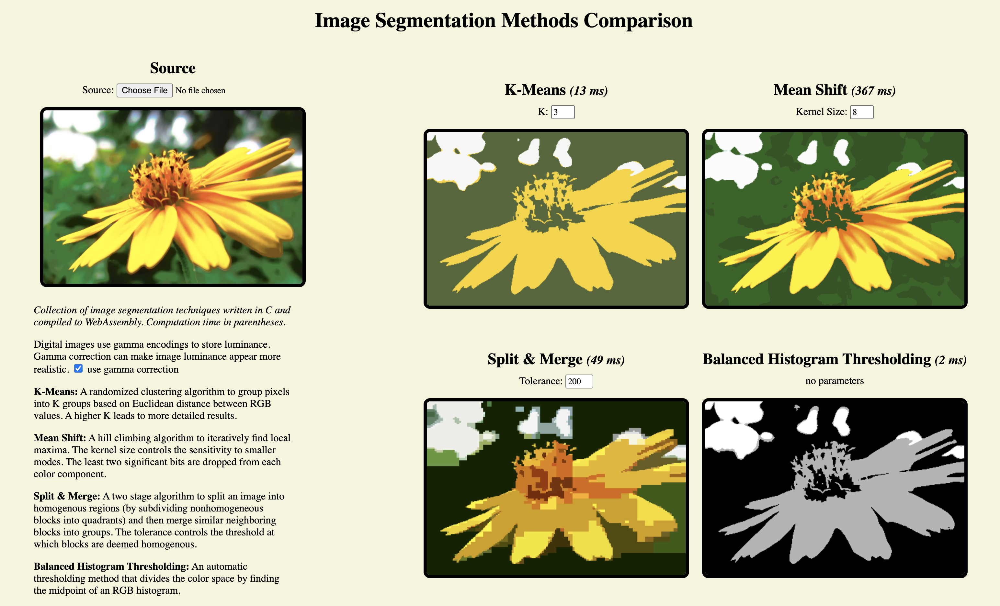

# Image Segmentation Demo

Implementation of four classical image segmentation methods in C compiled for the web.

## Usage

Go to [https://inventshah.github.io/image-segmentation/](https://inventshah.github.io/image-segmentation/) in your browser.

Or run locally:

1. `git clone https://github.com/inventshah/image-segmentation.git`
2. Start a static server `python -m http.server 8080`
3. Go to `localhost:8080` in your browser.



Change the parameters for each algorithm, toggle gamma correction, or click on an image to rerun the algorithm.

## Web Build

The [clang](https://clang.llvm.org/) compiler must be used.

Run `make wasm`

Non-make users:
`clang -Os -flto -msimd128 -mbulk-memory --target=wasm32 -nostdlib -Wl,--no-entry -Wl,--allow-undefined -o main.wasm src/meanshift.c src/kmeans.c src/histogram.c src/splitmerge.c src/utils.c src/utils_wasm.c`

## Native Build

Download the [libpng](http://www.libpng.org/pub/png/libpng.html) dependency.

Run `make native`

Non-make users: `cc -O3 -flto -o segment -lpng src/native.c src/kmeans.c src/meanshift.c src/histogram.c src/splitmerge.c src/utils.c`

Run any of the following to produce an out.png file:
```console
./segment kmeans <source png> <k value>
./segment meanshift <source png> <bandwidth value>
./segment splitmerge <source png> <tolerance>
./segment histogram <source png>
```

## Individual repositories

The implementations of the algorithms in this repository are based on the following:

-   https://github.com/inventshah/Kmeans-C
-   https://github.com/inventshah/Mean-Shift-C
-   https://github.com/inventshah/Balanced-Histogram-Thresholding-C
-   https://github.com/inventshah/Split-Merge-C

This repository updates those implementations for better WASM support.
